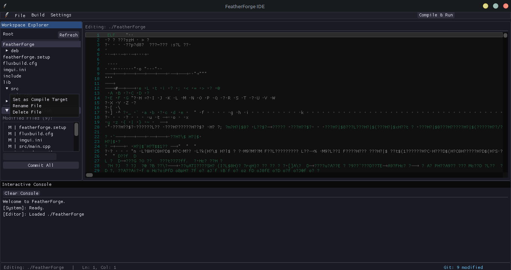

# FeatherForge (v1.0)
> **The Zero-Friction Desktop C++ IDE. No CMake. No Build Scripts. Just Code.**

FeatherForge is a hyper-lightweight, blazing-fast C++ integrated development environment engineered entirely in C++ over native OpenGL3 and ImGui. It is designed to completely eliminate the configuration bloat of traditional desktop build environments, allowing developers to rapid-prototype, integrate libraries, and write code with absolute zero environmental friction.

---

## Why FeatherForge?

| Feature | The FeatherForge Way | The Old Way |
| :--- | :--- | :--- |
| **Library Management** | Drop .a / .so binaries anywhere under lib/ (nested folders included). It auto-links, preferring static builds automatically. | Write 50 lines of verbose CMake configurations. |
| **Include Paths** | Drop headers into include/. It auto-includes. | Manually map targets and search path maps. |
| **Error Diagnostics** | On-demand background Clang linter with UI markers. | Sifting through scrolling terminal streams. |
| **RAM Footprint** | Ultralight overhead (Native graphics pipeline). | Multi-gigabyte Electron/Java infrastructure. |


---

## Installation & Deployment

FeatherForge v1.0 is packaged natively for Linux systems as an AMD64 Debian binary. You can download and install the package directly through your terminal using either of the automated methods below.

### Option 1: Download via curl
```
curl -L https://github.com/KinetiNode/Featherforge/raw/main/featherforge_1.0_amd64.deb -o featherforge_1.0_amd64.deb

```

### Option 2: Download via wget

```
wget https://github.com/KinetiNode/Featherforge/raw/main/featherforge_1.0_amd64.deb

```

### Local Package Installation

Once downloaded, install the .deb package along with its necessary system dependencies using your package manager:

```
sudo apt update && sudo apt install ./featherforge_1.0_amd64.deb

```

---

## Environment Prerequisites

FeatherForge relies on industry-grade compiler pipelines natively present on your machine. On its initial initialization block, the **Automated Onboarding Wizard** will run system diagnostics to verify:

1. **GCC/G++** (Supporting C++17 or higher) - *Required for binary building.*
2. **Clang / Clang++** - *Optional, drives the on-demand smart linter.*

If any component is missing, the onboarding wizard will surface quick-copy alignment commands (e.g., `sudo apt install build-essential`) to get your environment configured instantly.

> Note: GDB is **not** currently checked by the onboarding wizard or invoked anywhere in the build pipeline. The "Debug Build" toggle in Preferences compiles with `-g` debug symbols only — see [Debug Builds](#debug-builds-current-behavior) below for what it does today, and the Roadmap for planned GDB integration.

---

## The Zero-Friction Directory Matrix

FeatherForge completely replaces build scripts by utilizing strict directory conventions, resolved relative to whichever project folder you have open (not wherever the app happened to launch from). Organize your custom workspace folder exactly like this, and the compiler engine will infer everything dynamically:

```
your_project/
├── src/
│   ├── main.cpp          <-- Main entry point file
│   └── physics_core.cpp  <-- Additional code blocks
├── include/
│   └── raylib.h          <-- Drop external library headers here
├── lib/
│   └── libraylib.a       <-- Drop precompiled libraries (.a / .so) here, nesting is fine
└── vendor/               <-- Optional: header-only libraries or bundled SDKs
    └── some_lib/
        └── include/...

```

* **Includes:** `include/` is passed to the compiler and linter as a single `-I` search path. Headers directly inside `include/` can be included by bare filename; a header nested inside a subfolder needs its path written relative to `include/` in your `#include` statement (e.g. `#include "json/json.h"` for a file at `include/json/json.h`).
* **Vendor Includes (recursive):** Every subdirectory under `vendor/` is automatically discovered and added as its own `-I` path — handy for header-only libraries or SDKs that ship with their own internal folder structure.
* **Smart Auto-Linking:** `lib/` and `vendor/lib/` are scanned **recursively**, so libraries can sit in nested subfolders (e.g. straight out of an extracted release archive) and still get picked up. Libraries are grouped by name, stripping the Unix `lib` prefix and extension (`libraylib.a` / `libraylib.so` both resolve to the same `raylib` entry) — if both a static (`.a`) and shared (`.so`) build of the same library are present, **the static build is linked automatically**, so your executable doesn't end up depending on a `.so` file at runtime. Versioned shared libraries (e.g. `libraylib.so.6.0.0`) are also detected and linked directly by path if no unversioned version is available. Library files that don't follow the `lib`-prefix naming convention are still linked, by full path, rather than being skipped.

---

## Core Feature Guides

### Compile Target Locking

To prevent the development environment from getting confused when building complex multi-file workspaces, FeatherForge uses a dedicated **Compile Target Anchor**.

Instead of compiling whichever random file you happen to be looking at, you explicitly lock your program's entry point:

1. Locate the file containing your `int main()` function within the left Workspace Explorer sidebar.
2. Right-click the file and choose **Set as Compile Target** from the context layout.
3. A `[*]` visual signature will pin next to the filename.
4. You can now edit deeply nested headers or source files, and hitting `F5` will reliably compile the correct entry target every time.



### Preferences Panel

FeatherForge keeps its core interface extremely minimal. Heavy background diagnostics are isolated within a modular preferences suite, which can be opened via **Settings > Preferences** or the `Ctrl + ,` shortcut.

* **Opt-In Clang Smart Linter:** Offloads real-time syntax checking to background worker threads using `std::async` and `std::future` to prevent editor lag.
* **Debug Builds (current behavior):** Toggling this and building with F5 compiles your target with `-g` debug symbols instead of `-O2` optimizations, so the resulting binary is ready to be attached to an external debugger (e.g. running `gdb ./build/yourprogram` yourself). It does not currently launch or wrap GDB automatically — see Roadmap.
* **Settings Persistence:** Checkbox changes take effect immediately in the running session, but are only written to a localized `featherforge.cfg` configuration file when you click **Save & Close**. Clicking **Cancel** discards unsaved changes and reloads the last saved values.


---

## Step-by-Step Workspace Tutorial

### 1. Opening a Project Environment

Launch FeatherForge from your system applications menu or your terminal. Go to the top file layout bar and select **File > Open Project...** The IDE calls a native `zenity` configuration portal allowing you to pick your project folder. The left sidebar explorer will dynamically generate a clean folder tree.


### 2. Setting Your Execution Target

To prevent the editor from getting confused when compiling multi-file projects, right-click your entry class (the file containing `int main()`) in the workspace explorer sidebar and click **Set as Compile Target**. A `[*]` visual indicator will lock next to the name, designating it as the active build pipeline anchor.

### 3. Compilation & Regex Error Routing

Press **F5** or click the **Compile & Run** action button on the main toolbar context. The IDE compiles your codebase and outputs logs to the base console.

If a compiler break occurs, the **Hybrid Interactive Console** parses raw compiler streams using a regex layout filter:

$$\text{Regex Signature: } \verb|^([^:\s]+):(\d+):(\d+):\s*(error|warning|note):\s*(.*)$|$$

Any compiler break turns into a clickable, red UI selection object. **Double-click the red error line**, and the editor will automatically adjust viewport visibility, shift focuses, and snap your cursor exactly to the calculated row and character column where the bug lives.


### 4. Background Threaded Diagnostics

To activate real-time typing alerts without inducing lag into your interface frame loop, go to **Settings > Preferences** and activate the **Opt-In: Clang Smart Linter**. The engine will safely instantiate non-blocking background workers using `std::async` and `std::future` to track syntax markers dynamically as you write.

---

## Operational Keyboard Layout Matrix

| Key Shortcut | Operation Scope | System Output Behavior |
| --- | --- | --- |
| `Ctrl + N` | New File | Spawns the file-creation popup; entering a nested path (e.g. `src/core/utils.cpp`) auto-builds any missing subdirectories. |
| `Ctrl + S` | Structural Editor | Writes current text modifications to disk and triggers an asynchronous linter loop. |
| `Ctrl + ,` | Preferences Modal | Toggles system preferences and the linter module. |
| `F5` | Compiler Engine | Automates project saving, collects auto-linking binaries, and executes g++ compilation. |

> New Folder creation is available via **File > New Folder** or right-clicking inside the sidebar — it does not currently have a dedicated keyboard shortcut.

---
## Current Limitations (v1.0)

FeatherForge is still under active development. While the current release is fully usable for small-to-medium C++ projects, there are several limitations that are planned to be addressed in the v2.x series.

### Build System
- Builds a single compile target rather than automatically compiling every source file in a project.
- No incremental builds; every build is a full rebuild.
- No CMake, Meson, Makefile or Ninja project import.
- No project-specific compiler flag editor.
- Dependency Management
- Automatic library discovery currently targets the conventional lib/ and vendor/lib/ directories.
- Does not yet download or build third-party libraries automatically.
- No package manager integration.
### Editor
- No code completion (IntelliSense/LSP).
- No symbol rename.
- No "Go to Definition."
- No code formatting.
- No minimap.
- No multi-cursor editing.
- No split editor view.
- No tabs (single editor view).
### Debugging
- Debug builds only generate debug symbols.
- No integrated GDB frontend.
- No breakpoints.
- No variable inspection.
- No call stack viewer.
- Workspace
- No global search.
- No replace-in-files.
- No project-wide symbol search.
- No build configurations.
- No workspace sessions.
### Git
- Basic Git integration only.
- No branch management.
- No merge conflict viewer.
- No commit history browser.
- No diff viewer.
- Platform Support
- Linux only.
- Windows and macOS support are planned.


Most of these limitations are already planned for FeatherForge v2.x. The current development focus is building a lightweight, reliable foundation before adding advanced IDE features such as intelligent code completion, integrated debugging, and project management.
---
## Roadmap for v2.0

The following features are targeted for future development cycles. These updates will be rolled out incrementally across minor semantic versions (v1.1, v1.2, etc.) rather than a single monolith release:

* **Search and Find:** Global and file-specific text search tools.
* **GDB-Backed Crash Catcher:** Real GDB integration — automatically running builds under GDB, intercepting segfaults, and piping a formatted backtrace into the editor. The current "Debug Build" toggle only adds `-g` debug symbols and does not yet drive GDB itself.
* **Compile from Source Utility:** A dedicated tool to pull down dependencies from remote source links and compile them locally to handle missing precompiled library archives.
* **Windows Toolchain Support:** Native support for the Windows desktop ecosystem.
* **Manual Link-Type Override:** A per-library menu to explicitly force static vs. dynamic linking, for cases where you want to override the automatic static-preferred behavior.
* Note: Featherforge v2.0 will definitely be a complete IDE you can actually make apps on not just a prototyping software.
---

## Licensing & Technical Support

FeatherForge v1.0 is **100% Free to Use** as a standalone application profile for personal, educational, or commercial desktop deployment pipelines. Note that the codebase is closed source.

For technical bug tracking, ecosystem inquiries, or development ticket support, please submit a clear log export package to our dedicated product queue:

* **Official Developer Context Portal:** KinetiNode+support@proton.me
* **Official Website:** KinetiNode.pages.dev *(Note: The dedicated FeatherForge product page is currently under active development)*

*FeatherForge is curated and maintained under the KinetiNode development pipeline.*
